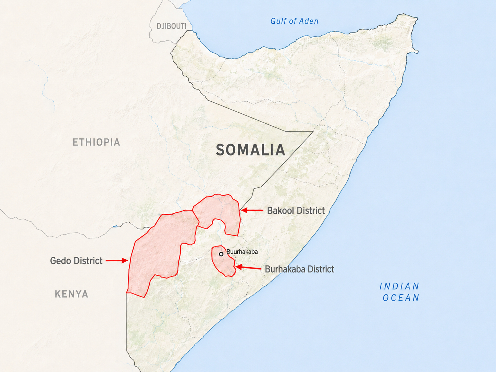
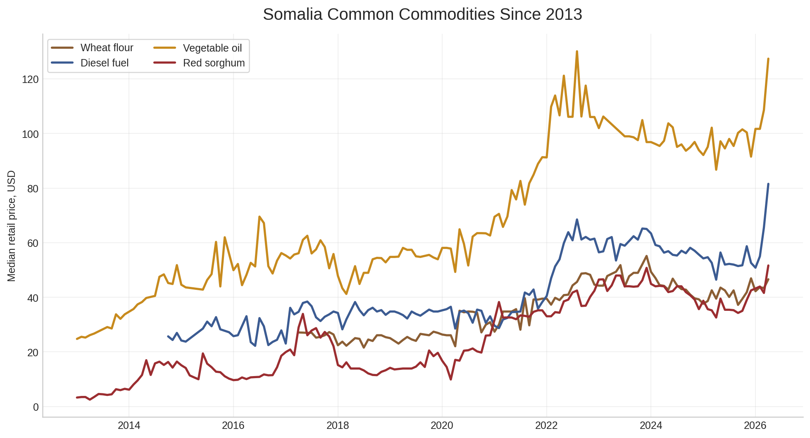
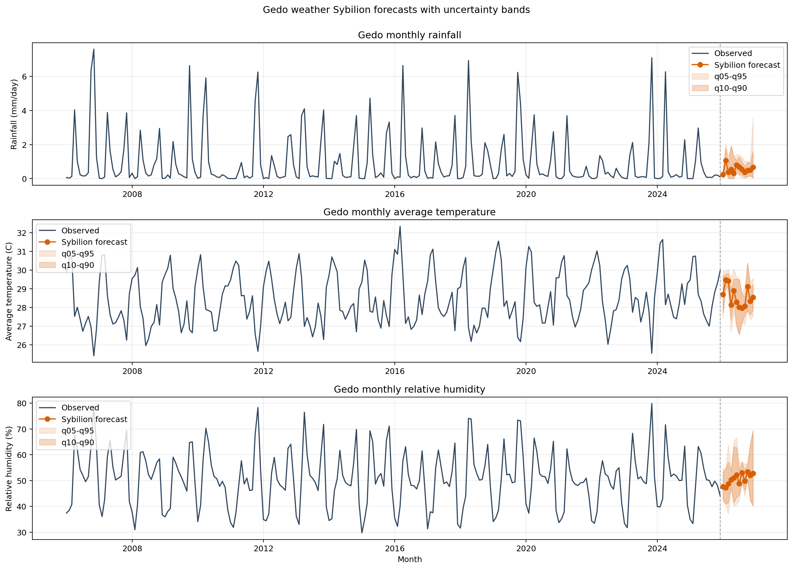
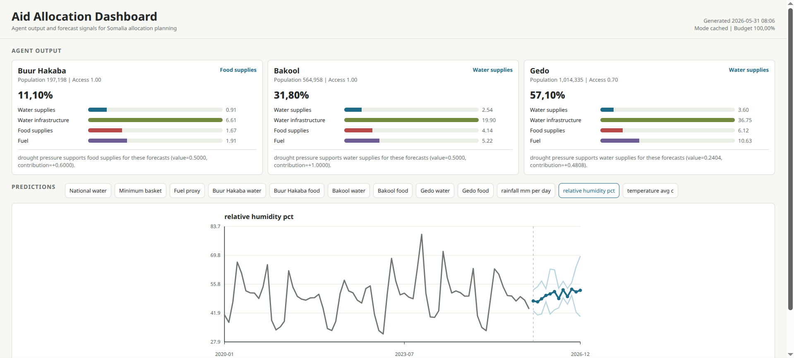

# aid-ressource-allocation-engine

*A decision-support engine for humanitarian aid allocation in Somalia. The system combines regional food and water forecasts, national CMB and fuel proxies, and Copernicus weather indicators to allocate scarce aid capacity across food supplies, water supplies, fuel, and water infrastructure equipment, with an overall deterministic reasoning summary.*

## Somalia

Somalia has suffered from prolonged conflict, resulting in weak infrastructure on top of that recurrent droughts, and heat waves plaege the region. As a result the somali population regularly suffers from water and food shortages often resulting in wide spread famines.


Thats where Humanitarian organisations step in, but - funding  is limited. Moreover is it often wasted by poor ressource management. Humanitarian organisations have trouble predicting where and in which quantity certain aids will be needed.


## Upside

Somalia has a useful advantage: time-series data for food, water, and fuel prices is surprisingly available. 
Because food and water are sourced regionally, regional weather data can be used as an early indicator for drought pressure and future market stress.


## Idea

Combine regional and national market time series for food, water, and fuel prices with weather data.

The resulting time series are sent to Sybilion for forecasting. A deterministic, rule-based agentic layer then turns those forecasts into interpretable resource-allocation signals: where aid should go and how the available capacity should be split across goods.

## area of interest

We focus on Gedo, Bakool, and the Buur Hakaba district in Bay. Buur Hakaba is modeled as its own water-price area; food pressure for Buur Hakaba uses the available Bay WFP market proxy because the current WFP CSV has no Buur Hakaba food rows.



## Data And Sybilion

### Somali Markets

Regional markets for water and food prices.

National market proxies are used for the Cost of Minimum Basket and fuel prices to optian a noition of purchasing power and as fuel prices dont vary much per region.



### Weather Data

Weather data comes from the Copernicus Climate Data Store, using ERA5-Land monthly averaged reanalysis, we mapped polygons over the affected regions and retrieved following values:

- rainfall
- relative humidity
- average temperature



## Agent Layer

Funding is the bottleneck. The agent receives the funding and allocates ressources where they are needed the most. 

The agents logic comprised of a formula which you can see with.

```bash
python app.py --mode cached --reasoning formula
```

Weights and other constants are freely customizable.

All agent constants live in `config.json`. Print the editable agent constants with short descriptions:

```bash
python app.py config-show
```

Print one constant or section with a dotted key:

```bash
python app.py config-show agent.total_budget
python app.py config-show agent.weights
```

Update one agent constant with `config-set`; values are parsed as JSON, so numbers, booleans, lists, and objects keep their type. Only `agent.*` keys can be changed from the CLI:

```bash
python app.py config-set agent.total_budget 100
python app.py config-set agent.weights.water_supplies 1.35
```

## Usage

Install dependencies:

```bash
python -m pip install -r requirements.txt
```

Live runs require a Sybilion token via `SYBILION_API_TOKEN` or `API_KEY.txt`. Fresh Copernicus weather fetches require CDS credentials via `CDSAPI_KEY` / `CDSAPI_URL` or a `.cdsapirc` file.

Run the full live pipeline, including fresh weather data, new Sybilion forecasts, and agent allocation. This fetches Gedo weather data from Copernicus and submits new Sybilion jobs for weather, water, CMB, fuel, regional water, and regional food forecasts.

```bash
python app.py
python app.py run
```

Run from cached data and cached/local forecasts:

```bash
python app.py --mode cached
python app.py run --mode cached
```

Generate a browser dashboard that visualizes agent output and prediction curves:

```bash
python app.py dashboard
```



Print a slick minimalist forecast UI in the terminal:

```bash
python app.py prediction-ui
python app.py prediction-ui --prediction regional-food --region Gedo
python app.py prediction-ui --prediction weather --weather-metric rainfall_mm_per_day
```

Run the compound drought-shock scenario for the live demo. It keeps cached data unchanged, modifies rainfall, humidity, and temperature forecasts in memory, and compares baseline allocation/reasoning with the stressed decision:

```bash
python scenarios/rainfall_weather_shock/run_rainfall_shock.py
```

For a narrated notebook walkthrough, open `scenarios/rainfall_weather_shock/rainfall_weather_shock.ipynb`.

Run the agent for selected regions or a custom budget:

```bash
python app.py run --agent-region Gedo
python app.py run --agent-region "Buur Hakaba"
python app.py run --agent-regions "Buur Hakaba" Bakool Gedo --agent-budget 12000000
```

Use local seasonal baselines for regional agent water/food inputs instead of live Sybilion forecasts:

```bash
python app.py run --agent-forecast-source local
```

Inspect and update agent configuration:

```bash
python app.py config-show
python app.py config-show agent.total_budget
python app.py config-set agent.total_budget 100
python app.py config-set agent.weights.water_supplies 1.35
```

See [USAGE.md](USAGE.md) for the full CLI documentation.

## data

| Source / database | Type | Extracted input features | Extracted output / prediction features |
|---|---|---|---|
| HDX – Somalia Price of Water | Water-price observations | Regional and national monthly water prices; district/region water-price aggregation for Somalia, Buur Hakaba, Bakool and Gedo | Water demand / water-shortage proxy forecasts based on national and regional water-price series |
| FSNAU / FAO Somalia – Cost of Minimum Basket (CMB), Total Basket with sorghum | Food basket / household cost index | National monthly CMB USD; average household minimum food basket cost across regions | National food basket cost forecast |
| HDX – Somalia Food Prices, sourced from WFP Price Database | Market prices for food and fuel | National fuel prices; regional food prices for Bay/Buur Hakaba, Bakool and Gedo; commodity-level market prices aggregated monthly | Fuel cost forecast; regional food-price forecasts for Bay/Buur Hakaba, Bakool and Gedo |
| Copernicus Climate Data Store API – ERA5-Land monthly averaged reanalysis | Satellite / weather reanalysis | Rainfall, average temperature and relative humidity, clipped to national and regional polygons | Weather covariates used as model inputs; no direct forecast output produced from this source |
| Sybilion forecasting pipeline | Model output | Cleaned monthly series used as model inputs after interpolation / seasonal extension | Point forecasts and quantile forecasts for water shortage, CMB, fuel cost and regional food-price proxies |
